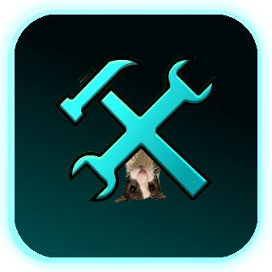

# Better Dialog API
Make sure to add the api to the modjson 

```json
{

"dependencies": [
        {
            "id": "viper.better_dialog",
            "version": ">=v1.0.0",
            "importance": "required"
        }
	],

}
```
Example code that makes it when you click F it brings a Dialog box up!
```cpp
// this is the api to include
#include <viper.better_dialog/include/Main.hpp>

// geode includes for example (for key press for f)
#include <Geode/modify/CCKeyboardDispatcher.hpp>
#include <Geode/Geode.hpp>
using namespace geode::prelude;

class $modify(CCKeyboardDispatcher) {
	bool dispatchKeyboardMSG(cocos2d::enumKeyCodes key, bool down, bool repeat) {
    if (key == enumKeyCodes::KEY_F && down) {
            auto dialog = DialogApi::create(DialogApi::create(
                            "Example",
                            "Example",
                            CCSprite::createWithSpriteFrameName("checkpoint_01_001.png"), 1.0f, false, ccWHITE
                        ), 2);
            dialog->updateChatPlacement(DialogChatPlacement::Center);
            dialog->animateInRandomSide();
            dialog->addToMainScene();
        }
    }
}
```

Example code that makes it when you click I it brings a Dialog box up and when you click ok it runs a function!
```cpp
// this is the api to include
#include <viper.better_dialog/include/Main.hpp>

// geode includes for example (for key press for I)
#include <Geode/modify/CCKeyboardDispatcher.hpp>
#include <Geode/Geode.hpp>
using namespace geode::prelude;

class $modify(CCKeyboardDispatcher) {
	bool dispatchKeyboardMSG(cocos2d::enumKeyCodes key, bool down, bool repeat) {
    if (key == enumKeyCodes::KEY_I && down) {
            auto dialog = DialogApi::create(DialogApi::create(
                            "Example",
                            "Example",
                            CCSprite::createWithSpriteFrameName("checkpoint_01_001.png"), 1.0f, false, ccWHITE
                        ), 2,[](){
                              geode::createQuickPopup("Hello From Example!","Hello!","OK",nullptr,nullptr,true);
                        });
            dialog->updateChatPlacement(DialogChatPlacement::Center);
            dialog->animateInRandomSide();
            dialog->addToMainScene();
        }
    }
}
```

To view more apis view Main.hpp


This is where she makes a mod.